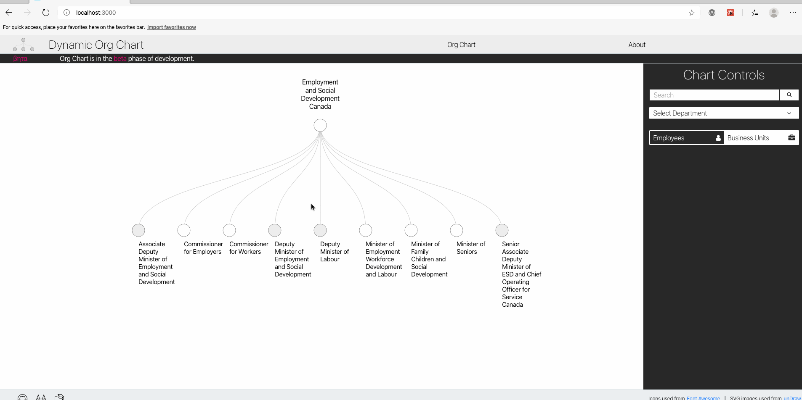

***PROJET - PAGE EN DÉVELOPPEMENT (TRADUCTION FRANÇAISE PRÉPARÉE AVEC [DeepL - version gratuite](https://www.deepl.com/translator))

    <a href="https://github.com/DSD-ESDC-EDSC/dynamic-org-chart/blob/master/README.md">English</a>

# Aperçu du projet

L'organigramme dynamique (DOC) offre aux utilisateurs la possibilité de rechercher des organigrammes dérivés pour de nombreux ministères du gouvernement du Canada. Il est exécuté en tant que projet ouvert par la Division des sciences des données au sein du Bureau de la dirigeante principale des données du ministère de l'Emploi et développement social Canada (EDSC), en collaboration avec l'équipe des Ressources humaines et de l'Innovation commerciale. Il est construit en utilisant le même ensemble de données que celui qui sous-tend les [Services d'annuaires gouvernementaux électroniques (SAGE)](https://ouvert.canada.ca/data/fr/dataset/8ec4a9df-b76b-4a67-8f93-cdbc2e040098), qui est mis à jour toutes les 24 heures et disponible sur le [Portail canadien de données ouvertes] (https://ouvert.canada.ca/fr/donnees-ouvertes) sous la [Licence de gouvernement ouvert](https://ouvert.canada.ca/fr/licence-du-gouvernement-ouvert-canada) du gouvernement du Canada. DOC se compose de deux éléments principaux :

1. Plusieurs programmes qui téléchargent et traitent l'ensemble des données SAGE ouvertes toutes les 24 heures dans un format hiérarchique qui peut être utilisé pour relier les employés aux unités organisationnelles et vice versa.
2. Une application web qui, en utilisant les données SAGE traitées, permet aux utilisateurs de naviguer dynamiquement dans les organigrammes dérivés ainsi que de faire des recherches dans le répertoire des unités commerciales et des employés. L'application permet de croiser ces deux sources d'information ; les utilisateurs peuvent rechercher des employés/unités commerciales et voir où ils se trouvent sur un organigramme, ou ils peuvent naviguer dans l'organigramme et voir quels employés appartiennent à une unité commerciale donnée.

DOC, une fois pleinement réalisé, rend la tâche de trouver qui travaille où et sur quoi, dynamique, visuelle et plus efficace.

## Histoire

Le DOC a commencé comme une ramification d'un projet ChatBot connexe visant à améliorer l'efficacité de l'embarquement des nouveaux employés. Lors des tests sur le ChatBot, de nombreux nouveaux employés ont fait remarquer qu'ils ne trouvaient pas de solution claire pour identifier où travaillent les autres employés et comment les différentes parties de l'organisation sont liées les unes aux autres. Sur la base de cette constatation, on a commencé à créer un moyen facile pour les fonctionnaires de rechercher d'autres employés et unités commerciales, puis de relier automatiquement ces informations à la structure de l'organisation. En outre, afin d'accroître la disponibilité et l'accès à l'outil, l'accent a été mis sur l'utilisation de logiciels et de données libres afin de faciliter le partage, la collaboration et la transparence avec tous ceux qui pourraient bénéficier du produit final ou réutiliser des parties de son code - le terme "projet ouvert" est utilisé pour décrire cette idée. 

Avec la construction d'un prototype, des tests avec des utilisateurs potentiels ont montré qu'il existe une demande pour une nouvelle façon de rechercher et de naviguer dans la structure de l'organisation. Le travail se concentre maintenant sur l'achèvement de la version bêta de DOC ainsi que sur la publication de l'ensemble du code.

## Motivation et valeur commerciale
Un examen des outils existants pour naviguer dans les données SAGE a révélé quelques domaines clés qui pourraient être améliorés. Les domaines à améliorer et la manière dont le DOC les aborde sont énumérés ci-dessous.

### 1. Typos and Spelling Mistakes

> __Les outils de recherche actuels ne semblent pas résister aux fautes de frappe et d'orthographe. Il arrive souvent qu'un utilisateur ne connaisse pas l'orthographe exacte d'un nom ou d'une unité commerciale, ce qui rend difficile la recherche d'équipes et d'individus.__

Le DOC exploite [Elasticsearch](https://www.elastic.co/), un moteur de recherche open source qui peut être utilisé pour indexer et rechercher des documents textuels. Plutôt que de rechercher des correspondances exactes sur la recherche de l'utilisateur, Elasticsearch attribue un score à chaque document en fonction de sa pertinence pour la recherche de l'utilisateur.

Cela signifie que des résultats de recherche corrects apparaîtront même en présence de petites fautes de frappe et d'orthographe. Un GIF plus bas dans ce document montre un exemple où le terme de recherche "__jean moulec__" identifie correctement "__Jean Le Moullec__" comme deuxième résultat dans la liste - Jean Le Moullec est l'un des membres de l'équipe travaillant sur DOC.

### 2. Pas d'organigramme gouvernemental central et ouvertement disponible

> __Les divisions et les directions ont des organigrammes internes et les ministères ont parfois des pages web décrivant leur structure, mais il ne semble pas y avoir de source centrale d'organigrammes ouvertement accessible et navigable.__

L'application web pour DOC présente un organigramme dynamique, interactif et interrogeable pour la fonction publique fédérale canadienne. La structure organisationnelle du gouvernement fédéral canadien est implicitement définie dans l'ensemble de données SAGE, et les programmes du DOC extraient automatiquement cette structure organisationnelle.

Cela signifie que, tant que les informations contenues dans SAGE sont tenues à jour, les organigrammes de l'ensemble de la fonction publique sont disponibles par l'intermédiaire du DOC. De plus, comme l'ensemble des données SAGE est mis à jour toutes les 24 heures, les organigrammes du DOC peuvent être mis à jour sans effort.

### 3. Pas de voie rapide pour croiser les employés avec la structure organisationnelle

> __Il ne semble pas y avoir de moyen simple de recouper les informations sur les employés avec les informations sur l'organisation. Exemple de cas d'utilisation : un utilisateur veut savoir qui est le directeur qui supervise une équipe particulière ou qui contacter à partir d'une équipe donnée.__

Le DOC a été initialement conçu pour résoudre exactement ce problème. D'un simple clic, les utilisateurs peuvent identifier où un employé travaille, où se trouve une unité commerciale dans l'organisation et qui sont les membres de l'équipe dans une unité commerciale particulière. Avec DOC, il est extrêmement rapide de relier ces deux sources d'information l'une à l'autre.

## Analyse documentaire et résultats connexes

Il existe des outils qui permettent aux utilisateurs de rechercher des données du répertoire des employés fédéraux, dont le principal est le [SAGE](https://geds-sage.gc.ca/fr/SAGE?pgid=002) lui-même. En cliquant sur un employé dans SAGE, il est possible de voir les coordonnées de l'employé ainsi que son lieu de travail au sein de l'organisation. Cependant, d'après nos interactions avec les utilisateurs, SAGE ne semble pas être très résistant aux fautes de frappe et d'orthographe. SAGE semble permettre plusieurs façons de formater un nom (par exemple, "prénom nom nom", "nom, prénom", etc.) mais recherche des correspondances exactes (c'est-à-dire une orthographe plus précise). Une autre faiblesse de cet outil est qu'il n'offre aucun moyen de visualiser ou d'interagir dynamiquement avec un organigramme, bien que les informations soient disponibles dans l'ensemble de données sous-jacent (ce qui peut être fait dans DOC).

Les services externes qui semblent utiliser les données SAGE pour permettre aux utilisateurs de rechercher des employés fédéraux sont [goc411.ca](http://www.goc411.ca/) et [opengovca.com](https://opengovca.com). Ces services présentent les informations sur les employés de manière légèrement différente mais, comme les SAGE, ils offrent un ensemble limité de fonctionnalités.

## L'outil et ses caractéristiques
La section ci-dessous met en évidence les caractéristiques que le DOC offre de manière plus détaillée. En outre, de courts GIF sont présentés pour illustrer le fonctionnement de chaque fonctionnalité.

### Explorez les organigrammes dérivés des ministères du gouvernement de manière interactive
La pièce maîtresse du DOC est l'organigramme interactif du gouvernement du Canada. Les utilisateurs peuvent sélectionner un ministère dans un menu déroulant, et leur organigramme (basé sur les données SAGE) apparaîtra instantanément à l'écran.

Une fois qu'un organigramme est sélectionné, les utilisateurs peuvent cliquer sur les nœuds pour agrandir ou réduire les unités commerciales. Les nœuds gris sont des unités commerciales qui ont des unités commerciales en dessous d'elles, tandis que les nœuds blancs ne contiennent pas d'unités commerciales en dessous d'elles. De cette façon, les utilisateurs sont libres d'explorer les organigrammes. Le GIF ci-dessous montre un exemple d'utilisateur explorant l'organigramme pour Emploi et Développement social Canada.

La visualisation de l'organigramme prend en charge la fonctionnalité de panoramique et de zoom, de sorte que les utilisateurs peuvent étendre la vue de l'organigramme bien au-delà de leur taille d'écran, tout en naviguant avec succès grâce à la fonctionnalité de panoramique et de zoom.

### Recherche d'employés
Les utilisateurs peuvent trouver des employés grâce à une recherche en texte libre. Grâce à Elasticsearch, DOC est résistant à de nombreux types de fautes de frappe, d'orthographe, ainsi qu'aux variations de formatage des noms. Le GIF ci-dessous illustre l'exemple mentionné précédemment d'une recherche pour "__jean moulec__" renvoyant correctement un résultat pour "__Jean Le Moullec__", même si le terme recherché contient plusieurs fautes d'orthographe.

### Recherche d'unités commerciales 
Cette fonctionnalité est mise en œuvre en arrière-plan, mais pas encore en avant-plan. Une fois terminée, elle fonctionnera de la même manière que la recherche d'employés, mais pour les unités commerciales.

### Voir Qui travaille dans une unité commerciale donnée 
Il est possible d'effectuer une recherche avec DOC dans le sens inverse de ce qui est mentionné ci-dessus. Si l'on donne une unité commerciale, l'utilisateur peut voir toutes les personnes qui travaillent dans cette unité. Les cas d'utilisation pour cela comprennent, par exemple, le fait de vouloir savoir qui d'autre travaille dans l'équipe d'un employé ou de vouloir trouver le responsable d'un employé. Le GIF ci-dessous illustre, toujours en utilisant un membre de l'équipe de développement du DOC, une recherche pour "__brown, collin__" et identifie correctement les membres de son équipe en cliquant sur le bouton "__See the team__".

# Détails techniques
Les sections suivantes détaillent l'architecture, la pile technique (logiciels à source ouverte) et les données ouvertes utilisées dans DOC.

## Architecture de haut niveau
Ce dépôt relie plusieurs dépôts qui forment le DOC Open Project. Les dépôts connexes se trouvent ci-dessous :

- [User Interface (React and d3)](https://github.com/DSD-ESDC-EDSC/dynamic-org-chart-ui)
- [Back-end API (Flask) for data on employees and organizations](https://github.com/DSD-ESDC-EDSC/dynamic-org-chart-api)
- [Scheduled job (Python) to download and process GEDS data](https://github.com/DSD-ESDC-EDSC/dynamic-org-chart-scripts)

<!-- original graph -->
<!--  "scheduled job" [color="blue" label="downloads"];
"scheduled job" -> "Elasticsearch" [color="red" label="writes to"];
"scheduled job" -> "SQL Database" [color="red" label="writes to"];
"Flask API" -> "SQL Database" [label="reads from"];
"Elasticsearch" -> "Front End";
"Flask API" -> "Front End";
"Front End" -> "Flask API";
"Front End" -> "Elasticsearch";
}'/> -->

## Logiciel de saisie
Le code de ce projet développé par l'équipe de la science des données traite les données SAGE dans un format hiérarchique qui peut être consommé par la bibliothèque de visualisation de données d3 de Javascript. De plus, les données de ce csv peuvent être utilisées pour remplir plusieurs tables dans une base de données SQL. Entre ces deux sources de données (et avec l'aide d'Elasticsearch pour indexer les noms des employés et des unités organisationnelles), il est possible de relier les employés à la structure organisationnelle, et vice versa.

L'interface utilisateur est une application [React](https://reactjs.org) qui utilise la bibliothèque de visualisation de données Javascript [d3](https://d3js.org) pour créer l'organigramme interactif. L'API REST est construite sur la microstructure [Flask](https://palletsprojects.com/p/flask/) de Python. Le projet utilise [Elasticsearch](https://www.elastic.co/) comme cadre de recherche à source ouverte, et a utilisé [SQLite](https://www.sqlite.org/index.html) comme base de données relationnelle à source ouverte à des fins de développement. Le [SQLAlchemy](https://www.sqlalchemy.org/) a été utilisé comme mappeur relationnel objet (ORM), de sorte que la migration vers une base de données de production est adaptable à toutes les variantes de bases de données SQL prises en charge par SQLAlchemy.

## Sources de données d'entrée
L'ensemble de ce projet est basé sur des **données ouvertes**, principalement la [base de données SAGE] (https://ouvert.canada.ca/data/fr/dataset/8ec4a9df-b76b-4a67-8f93-cdbc2e040098), qui est disponible sous la licence de données ouvertes du gouvernement du Canada - [Licence du gouvernement ouvert – Canada] (https://ouvert.canada.ca/fr/licence-du-gouvernement-ouvert-canada). Toutes les 24 heures, cet ensemble de données est mis à jour sur le [Portail de données ouvertes] du gouvernement du Canada (https://ouvert.canada.ca/fr/donnees-ouvertes) sous la forme d'un fichier csv unique.

TEST TEST TEST

# Licence
Sauf indication contraire, le code source de ce projet est protégé par le droit d'auteur de la Couronne du gouvernement du Canada et distribué sous la [licence MIT](https://github.com/DSD-ESDC-EDSC/dynamic-org-chart/blob/master/LICENSE.md).

Le mot-symbole « Canada » et les éléments graphiques connexes liés à cette distribution sont protégés en vertu des lois portant sur les marques de commerce et le droit d'auteur. Aucune autorisation n'est accordée pour leur utilisation à l'extérieur des paramètres du programme de coordination de l'image de marque du gouvernement du Canada. Pour obtenir davantage de renseignements à ce sujet, veuillez consulter les [Exigences pour l'image de marque](https://www.canada.ca/fr/secretariat-conseil-tresor/sujets/communications-gouvernementales/exigences-image-marque.html).

# Attribution
Ce projet ne serait pas possible sans la disponibilité et l'utilisation de logiciels à source ouverte. La reconnaissance et l'attribution des outils open source utilisés, ainsi que les licences ouvertes correspondantes (lorsqu'il y en a une), se trouvent dans le fichier [ATTRIBUTION.md](https://github.com/DSD-ESDC-EDSC/dynamic-org-chart/blob/master/ATTRIBUTION.md) de ce dépôt. Il est conseillé aux utilisateurs de consulter les sources originales pour obtenir des informations officielles, en particulier s'ils prévoient de redistribuer tout ou partie de ces artefacts de code.

# Comment contribuer
Les instructions sur la façon de contribuer se trouvent dans le document [CONTRIBUTING.md](https://github.com/DSD-ESDC-EDSC/dynamic-org-chart/blob/master/CONTRIBUTING.md).

