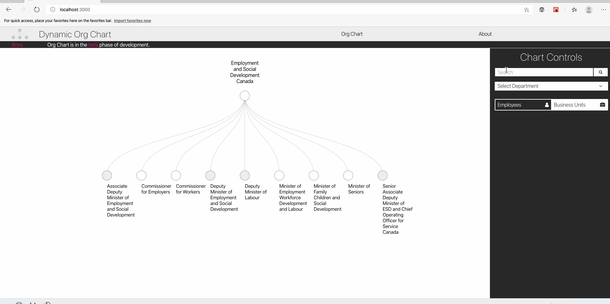

    <a href="https://github.com/DSD-ESDC-EDSC/dynamic-org-chart/blob/master/README.fr.md">Français</a>

# Project Overview

The Dynamic Organizational Chart (DOC) provides users the ability to search derived org charts for many Government of Canada departments and is executed as an open project by the Data Science Division within the Chief Data Office of Employment and Social Development Canada (ESDC), in collaboration with the Human Resources and Business Innovation team. It is built using the same dataset that underpins the [Government Electronic Directory Services (GEDS)](https://open.canada.ca/data/en/dataset/8ec4a9df-b76b-4a67-8f93-cdbc2e040098), which is updated every 24 hours and made available on the [Canada Open Data Portal](https://open.canada.ca/en/open-data) under the Government of Canada's [Open Government License](https://open.canada.ca/en/open-government-licence-canada). DOC consists of two major components:

1. Several programs that download and process the open GEDS dataset every 24 hours into a hierarchical format that can be used to link employees to organizational units and vise versa.
2. A web application that, using the processed GEDS data, allows users to dynamically navigate the derived org charts as well as search the directory of business units and employees. The application makes it possible to cross reference these two information sources; users can search for employees/business units and see where they are on an org chart, or they can navigate the org chart and see which employees belong to a given business unit.

DOC, once fully realized, makes the task of finding who works where and on what, dynamic, visual, and more efficient.

## History

DOC began as an offshoot of a related ChatBot project aimed to improve the efficiency of new employee onboarding. During testing on the ChatBot, many new employees pointed out that they couldn't find any clear solution to identify where other employees work and how different parts of the organization relate to eachother. Based on this finding, exploration began into creating an easy way for civil serants to search for other employees and business units and then automatically link this information to the organization's structure. Furthermore, so as to increase the availabilty and access of the tool, emphasis was placed on using open source software and open data in order to facilitate sharing, collaboration, and transparancy with all who might benefit from the end product or reuse parts of its code - the term Open Project is used to describe this thought. 

With a prototype build, testing with potential users showed demand for a new way to searth through and navigate the organization structure exists.  Work now focuses on completing the beta version of DOC as well as releasing all the code.

## Motivation and Business Value
An examination of existing tools for navigating GEDS data revealed a few key areas that could be improved upon. Listed below are the areas for improvement, and how DOC addresses them.

### 1. Typos and Spelling Mistakes

> __Current search tools do not appear to be robust to typos and spelling mistakes. Often times, a user may not know the exact spelling of a name or business unit, which makes it challenging to find teams and individuals.__

DOC leverages [Elasticsearch](https://www.elastic.co/), an open source search engine that can be used to index and search text documents. Rather than looking for exact matches on the user's search, Elasticsearch assigns a score to each document based on how relevant it is to the user's search.

This means that correct search results will appear even in the presence of small typos and spelling mistakes. A GIF further down in this document shows an example where the search term "__jean moulec__" correctly identifies "__Jean Le Moullec__" as the second result in the list - Jean Le Moullec is one of the members of the team working on DOC.

### 2. No Central and Openly Available Government Org Charts

> __Divisions and directorates have internal facing org charts and government departments sometimes have web pages outlining their  structure, however, there does not appear to be an openly acccessible and navigatable central source for organizational charts.__

The web application for DOC features a dynamic, interative, and searchable organizational chart for the Canadian federal public service. The organization structure for the Canadian Federal Government is implicitly defined in the GEDS dataset, and the programs in DOC automatically extract this organization structure.

This means that, as long as the information in GEDS is kept up to date, organizational charts for the entire public service are available through DOC. Additionally, since the GEDS dataset is updated every 24 hours, the org charts in DOC can be effortless up to date.

### 3. No Fast Way to Cross-Reference Employees With Organizational Structure

> __There appears to be no straightforward way to cross-reference employee information with organizational information. Example use cases: a user wants to know who is the director that oversees a particular team or who to contact from a given team.__

DOC was initially designed to solve exactly this problem. With a single click, users can identify where an employee works, where a business unit is in the organization, and who the team members are in a particular business unit. With DOC, it is extremely fast to link these two sources of information to one another.

## Literature Review & Related Findings

There are existing tools that allow users to search federal employee directory data, primary of which being [GEDS](https://geds-sage.gc.ca/en/GEDS?pgid=002) itself. When clicking on an employee in GEDS, it is possible to see employee contact information as well as where in the organization that employee works. Based on our interactions with users, however, GEDS does not seem to be very robust to typos and spelling mistakes. GEDS appears to allow for several ways of formatting a name (e.g. "first-name last-name", "last-name, first-name", etc) but searches for exact matches (i.e. propper spelling). Another weakness with this tool is that it does not offer any way to visualize or dynamically interact with an organizational chart, despite the information being available in the underlying dataset (which cane be done in DOC).

External services that appear to use GEDS data to allow users to seach for federal employees are [goc411.ca](http://www.goc411.ca/) and [opengovca.com](https://opengovca.com). These present the resulting employee information slightly differently but, like GEDS, offer a limited set of functionality.

## The Tool & Features
The section below specifically highlights the features that DOC offers in more detail. Additionally, short GIFs are shown to illustrate how each feature works.

### Explore Derived Government Department Org Charts Interactively
The centrepiece of DOC is the interactive org chart for the Government of Canada. Users can select a government department from a dropdown menu, and their org chart (based on GEDS data) will appear on the screen instantly.

Once an org chart is selected, users can click the nodes to expand or collapse business units. Grey nodes are business units that have business units underneath them, while white nodes do not contain business units underneath them. In this way, users are free to explore the organizational charts. The GIF below shows an example of a user exploring the org chart for Employment and Social Development Canada.

The org chart visualization supports pan and zoom functionality, so users can expand the view of the org chart well beyond their screen size, and still successfully navigate via the pan and zoom feature.

### Search Employees
Users can find employees with a free text search. Thanks to Elasticsearch, DOC is robust to many types of typos, spelling mistakes, as well as variations of name formatting. The GIF below illustrates the earlier mentioned example of a search for "__jean moulec__" correctly returning a result for "__Jean Le Moullec__", even though the search term contains several spelling mistakes.

### Search Business Units 
This functionality is implemented in the back-end but not yet in the front-end. Once complete it will funciton in the same way as one searches for employees but for business units.

### See Who Works in a Given Business Unit 
It is possible to search with DOC in the opposite direction to what is mentioned above. Given a business unit, the user can see all of the people who work in that unit. Use cases for this include, for example, wanting to know who else works on an employee's team or wanting to find the manager of an employee. The GIF below illustrates, again using a member of the DOC development team, a search for "__brown, collin__" and correctly identifies his team members when clicking the "__See the team__" button.

# Technical Details
The next sections details the architecture, tech stack (open source software), and open data used in DOC.

## High-level Architecture
This repository links together several repositories that form that DOC Open Project. The related repositories can be found below:

- [User Interface (React and d3)](https://github.com/DSD-ESDC-EDSC/dynamic-org-chart-ui)
- [Back-end API (Flask) for data on employees and organizations](https://github.com/DSD-ESDC-EDSC/dynamic-org-chart-api)
- [Scheduled job (Python) to download and process GEDS data](https://github.com/DSD-ESDC-EDSC/dynamic-org-chart-scripts)

<!-- original graph -->
<!--  "scheduled job" [color="blue" label="downloads"];
"scheduled job" -> "Elasticsearch" [color="red" label="writes to"];
"scheduled job" -> "SQL Database" [color="red" label="writes to"];
"Flask API" -> "SQL Database" [label="reads from"];
"Elasticsearch" -> "Front End";
"Flask API" -> "Front End";
"Front End" -> "Flask API";
"Front End" -> "Elasticsearch";
}'/> -->

## Input Software
The code in this project developed by the Data Science team processes GEDS data into a hierarchical format that can be consumed by Javascript's d3 data visualization library. Additionally, the data from this csv can be used to populate several tables in a SQL database. Between these two data sources (and with the help of Elasticsearch to index employee names and organizational units), it is possible to link employees to organizational structure, and vice versa.

The user interface is a [React](https://reactjs.org) application that makes use of Javascript's [d3](https://d3js.org) data visualization library to create the interactive org chart. The REST API is built on Python's [Flask](https://palletsprojects.com/p/flask/) microframework. The project makes use of [Elasticsearch](https://www.elastic.co/) as an open source search framework, and has used [SQLite](https://www.sqlite.org/index.html) as an open source relational database for development purposes. As an object relational mapper (ORM), [SQLAlchemy](https://www.sqlalchemy.org/) was used, so migration to a production database is adaptable to any of the flavours of SQL databases that are supported by SQLAlchemy.

## Input Data Sources
This entire project is built off of **open data**, primarily the [GEDS dataset](https://open.canada.ca/data/en/dataset/8ec4a9df-b76b-4a67-8f93-cdbc2e040098), which is made available under the Government of Canada's open data license - [Open Government Licence - Canada](https://open.canada.ca/en/open-government-licence-canada). Every 24 hours, this dataset is updated on the Government of Canada's [Open Data Portal](https://open.canada.ca/en/open-data) as a single csv file.

# License
Unless otherwise noted, program source code of this project is covered under Crown Copyright, Government of Canada, and is distributed under the [MIT License](https://github.com/DSD-ESDC-EDSC/dynamic-org-chart/blob/master/LICENSE.md).

The Canada wordmark and related graphics associated with this distribution are protected under trademark law and copyright law. No permission is granted to use them outside the parameters of the Government of Canada's corporate identity program. For more information, see [Federal identity requirements](https://www.canada.ca/en/treasury-board-secretariat/topics/government-communications/federal-identity-requirements.html).

# Attribution
The creation of DOC relied extensively on the use of open source software. Acknowledgement and attribution to these open source tools, along with their corresponding open licenses (where one was found), can be found in the [ATTRIBUTION.md](https://github.com/DSD-ESDC-EDSC/dynamic-org-chart/blob/master/ATTRIBUTION.md) file in this repository. Users are advised to consult original sources for official information, especially if they plan on re-distributing all or parts of these code artifacts.

# How to Contribute
Instructions for how to contribute can be found in the CONTRIBUTING.md file.
